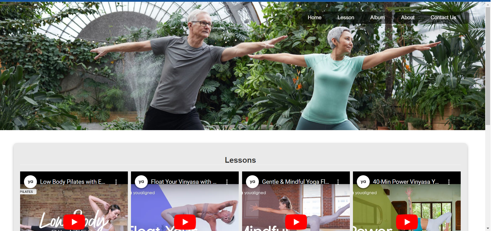
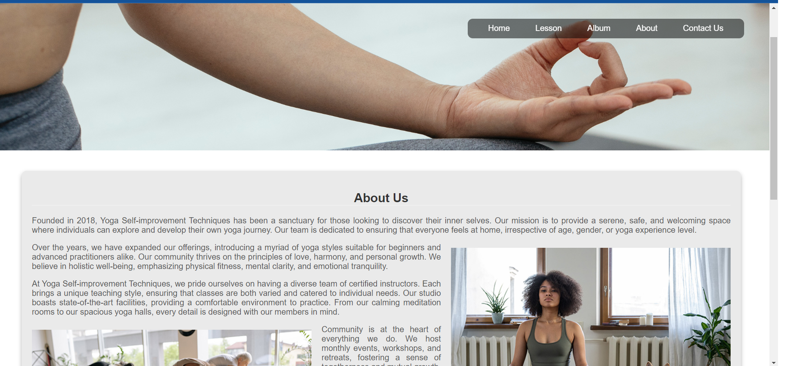

# Yoga Self-improvement Techniques Website

## Project Overview
This project aims to provide users with a platform to learn body/mind self-improvement techniques through yoga. The website caters to users interested in integrating yoga practices into their self-improvement journey. By focusing on various techniques and lessons, the website facilitates a holistic approach to personal growth and well-being.

## Features
- Technique Categories: Allows users to browse through various yoga techniques categorized for easier navigation.
- Technique Lessons: Detailed lessons for each technique, ensuring users understand the principles and execution.
- Supporting Media: Each lesson is accompanied by text, images, and videos demonstrating the technique, ensuring users have a visual guide.

## Deployment
- Clone the repository.
- Navigate to the root directory and open index.html in a web browser.
- Explore the website!
(You can also visit the website online at: https://64f4af36e822fe28e578c371--glistening-profiterole-976df0.netlify.app/)

## Testing
- All HTML code is validated using the official W3C validator.
- CSS is validated through the Jigsaw validator.
- Manual testing conducted for navigation, media playback, and responsivity across various device sizes.

## File and Code Organization
- All static assets, like images and videos, are stored in the assets directory, further categorized into sub-directories.
- Custom CSS is placed in external files located in the assets/css directory and linked in the HEAD element of the HTML pages.
- Code is organized and commented for clarity, maintainability, and future developments.

## Version Control
The project utilizes Git & GitHub for version control, ensuring a traceable and organized development process. All features and changes have been committed with clear, descriptive messages.

## Future Improvements
- Integration of user accounts for personalized lesson tracking.
- Inclusion of a feedback system to continuously improve lessons based on user input.

## Contributors
Acknowledgements
Yoga image sources: Pexels.com
Video content providers: Youtube.com
© 2023 Yoga Self-improvement. All rights reserved.